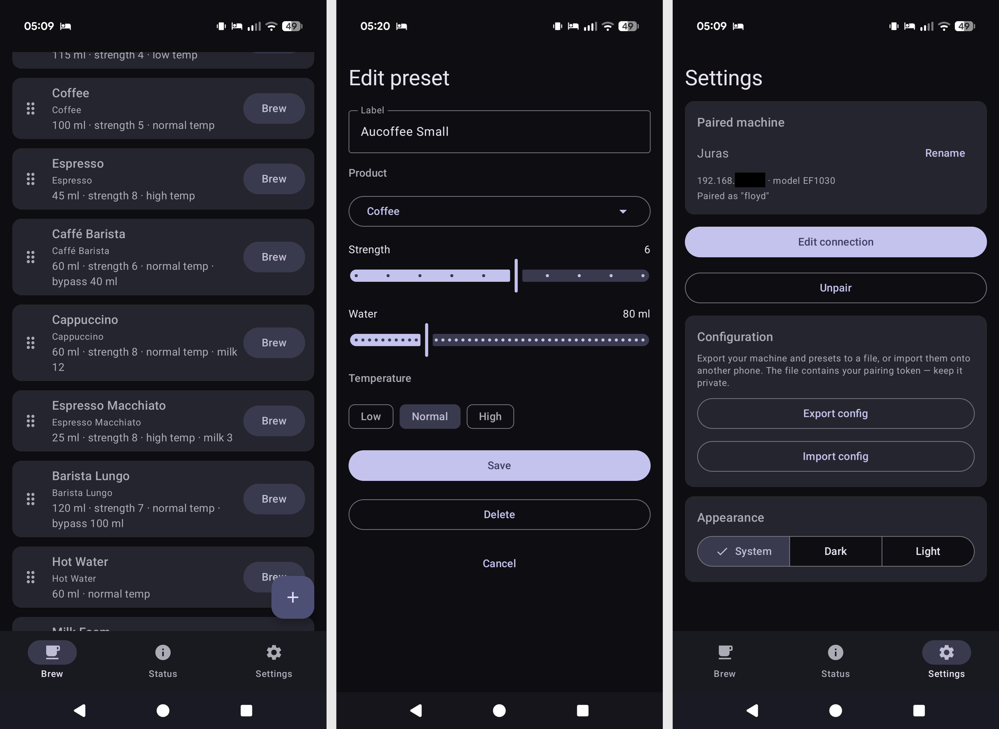

# Juras

 

A FOSS app for controlling **JURA coffee machines** over your local Wi-Fi
network.

Juras talks directly to a JURA machine fitted with a **WiFi Smart Connect v2**
module.

Differences with official app:

* Doesn't need *any* additional permissions like Location, Bluetooth, etc.
* You can export/import settings in a readable text format
* App can be compiled not only to run on Android, but also on any desktop environment
* In the opinion of its author this app has way more clear and less convoluted UX

## Origins and motivation

This project is a result of me pursuing several goals:

* To have a cup of coffee on my terms 
* Stock J.O.E. app experience is, well, not that smooth
* No FOSS solution for the Wi-Fi protocol (BLE Smart Connect implementation [exists](https://github.com/AlexxIT/Jura))
* I was interested if I would be able to reach MVP without touching a *single line of code* as a programmer

So, I performed duties of:

* Product Owner
* Tester
* Expert in reverse engineering
* Code reviewer

Actual code was produced by LLM in its entirety, from *A* to *Z*.
That being said, this wasn't "Chuck Norris mode" session where I 
would just answer "yes" to every proposal. I'm capable of
reading the resulting code and I reviewed it to the best of my abilities.

# Screenshots



## Features

- 📡 **Discover** your machine on the local network (UDP broadcast — no IP typing).
- 🔌 **Pair** with the machine: enter your setup PIN, confirm on the machine's
  screen, done. (An "Advanced" path lets you enter a known IP + token directly.)
- ☕ **Brew presets** — one per product, with the parameters each product actually
  supports (strength, water, temperature, milk foam, and bypass for the Barista
  drinks), bounded to the machine's valid ranges.
- 🎛️ **Customise & organise** — add/edit/delete presets, and **drag to reorder**
  them (hold the handle).
- ⚡ **Quick brew** — a one-time custom brew for a guest, without saving a preset.
- 🟢 **Live brewing** — start a brew and watch real-time progress (heating,
  grinding, dispensing with a water gauge), with a **Stop** button.
- 📊 **Status** — per-product brew counters, maintenance status (cleaning / filter
  / descaling), maintenance cycle counters, and live machine flags (e.g. "Fill
  water tank", "Coffee ready").
- 🔁 **Import / Export** your configuration (paired machine + presets) as a
  human-readable **YAML** file — move your whole setup to another controlling device. Imports
  are validated and replace the current config after a confirmation.

On first pairing the preset list is **seeded with every product** the machine
supports, so it's usable immediately.

## Limitations

- Initiation flow is currently unimplemented - you will need to connect your coffee 
  machine to your WiFi network with the stock app. After that you can safely
  pair with the machine from Juras and continue from there.
- Currently tested only on [E6](https://uk.jura.com/en/homeproducts/automatic-coffee-machines/e6-piano-black-ukc-15511)
  coffee machine with Smart Connect v2 module. For details see [protocol description](PROTOCOL.md).
  In theory should support other models, see `./protocol/src/commonMain/resources/catalogs` for the list
- Only one coffee machine can be paired to the app at the moment.


## Requirements

- **Android 8.0 (API 26)** or newer (mobile)
- **Linux/Windows 10+/macOS 14+** (desktop)
- A JURA machine with a **WiFi Smart Connect v2** module, on the **same Wi-Fi
  network** as the controlling device.
- The machine's **setup PIN** (the one configured during its initial registration).

> Note: machine discovery uses UDP broadcast, which doesn't traverse an Android
> emulator's NAT — test discovery on a real device. The "Advanced" manual pairing
> works anywhere.

## Using the app

1. **Settings → Connect a machine** (or the startup prompt on first launch).
2. **Scan**, pick your machine, enter the **setup PIN**, tap **Start pairing**.
3. Confirm *"pair with this device?"* on the machine's display.
4. You're in — the **Brew** tab is populated with default presets. Tap **Brew** on
   a card to make it, tap a card to edit it, or use **Quick brew** for a one-off.

---

## Building from source

Dependencies

* JDK 21 (`java` in `${PATH}`)
* Android SDK available at `${ANDROID_HOME}` (Desktop app can be built without it)

After that this project builds just like any other `gradle` project. You can see 
examples of the various build tasks in `./apk-*` and `./desktop-*` scripts.

### Release build (signed for sideloading to Android)

To install on real phones and be able to update them later, build a **release APK
signed with your own keystore**. This is a one-time setup.

1. **Create a keystore** (keep it safe — you need it to ship updates):

   ```bash
   keytool -genkeypair -v -keystore juras-release.jks \
     -alias juras -keyalg RSA -keysize 2048 -validity 10000
   ```

2. **Create `keystore.properties`** in the project root (this file is git-ignored):

   ```properties
   storeFile=juras-release.jks
   storePassword=YOUR_STORE_PASSWORD
   keyAlias=juras
   keyPassword=YOUR_KEY_PASSWORD
   ```

3. **Build:**

   ```bash
   ./gradlew :app:assembleRelease   # -> app/build/outputs/apk/release/app-release.apk
   ```

   When `keystore.properties` is present, the release build is signed
   automatically; otherwise it builds unsigned.

## Tech stack

- **Kotlin** + **Jetpack Compose** (Material 3), single-Activity **Navigation
  Compose** with a bottom-nav shell (Brew / Status / Settings).
- **DataStore** + kotlinx-serialization for persistence; reactive state via
  Kotlin coroutines/Flow. Config import/export uses **YAML** (`kaml`).
- **Gradle** (Kotlin DSL) with a version catalog.
- Two modules: a pure-Kotlin **`:protocol`** library (no Android dependencies,
  JVM-unit-tested) and the **`:app`** UI.
- minSdk 26 · target/compileSdk 36.

## Protocol

Protocol is implemented as a separate module located in `./protocol` which has its own
UTs and (hopefully) doesn't have any dependencies on Android/KMP in order to be more 
self-contained and reusable.

See [PROTOCOL.md](PROTOCOL.md) for a full protocol reference (transport, cipher, auth,
commands, and machine catalog format).

## Disclaimer

This is an independent, unofficial project. It is not affiliated with, endorsed
by, or supported by JURA. "JURA" and "J.O.E." are trademarks of their respective
owners. The protocol it speaks was reverse-engineered for interoperability; use
it with your own machine at your own risk.
